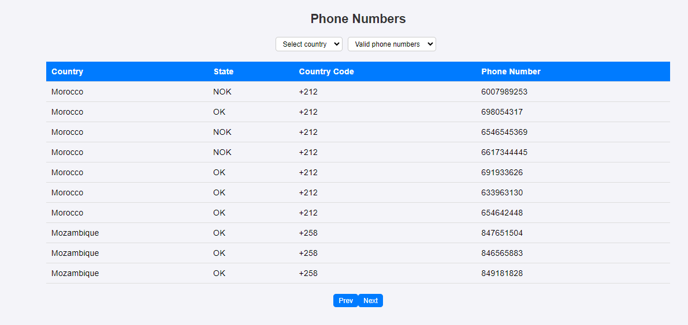

# Project Name: Phone Numbers APP

[](https://packagist.org/packages/laravel/framework)
[](https://packagist.org/packages/laravel/framework)
[](https://packagist.org/packages/laravel/framework)

## Screenshot



## Requirements

- PHP >= 8.2
- Composer
- Node.js >= 14
- Laravel
- Vue.js

## Installation

### Clone the repository and set up the application

```sh
git clone https://github.com/HannaKamil/phone-numbers-app-vue.git
```

```sh
cd phone-numbers-app-vue
```

### Backend Setup (Laravel)

```sh
composer install
```

```sh
cp .env.example .env
```

```sh
php artisan key:generate
```

```sh
php artisan migrate --seed
```

### Frontend Setup (Vue.js)

```sh
npm install
```

### Run the application

- For Laravel Backend:

```sh
php artisan serve
```

- For Vue.js Frontend:

```sh
npm run dev
```

Visit `http://localhost:8000` to see your application in action.

### Download Directly

You can also download the latest version of the application directly from Google Drive:

[Download Phone Numbers APP](https://drive.google.com/file/d/1gYUWqnEr_fKhY0Ofc_swudf2dLFL2DGl/view?usp=drive_link)

## Usage

1. **Frontend**: The Vue.js SPA handles the user interface, including dropdowns for filtering phone numbers and pagination.

2. **Backend**: The Laravel API serves phone numbers based on the selected filters and handles CRUD operations.

## API Endpoints

- **Get Phone Numbers**: `GET /api/phone-numbers`  
  Fetches phone numbers with optional filters for country and state.

- **Get Countries**: `GET /countries`  
  Fetches a list of distinct countries from the phone numbers dataset for use in dropdowns.

## Contributing

Feel free to submit issues or pull requests to improve the application.
